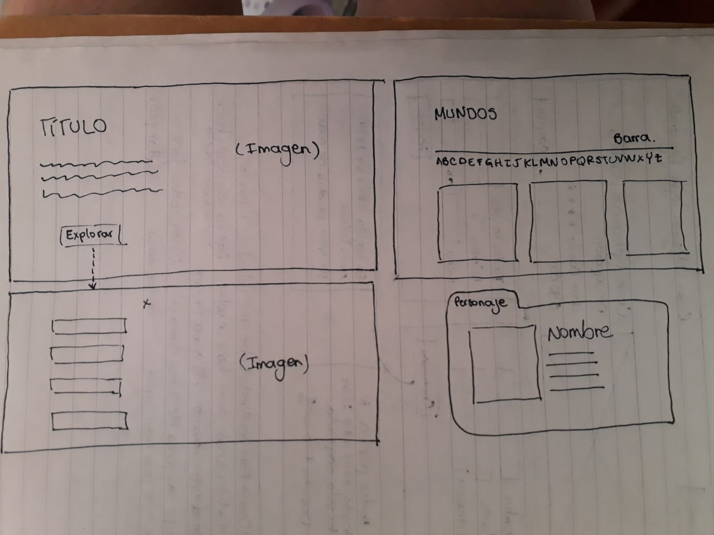
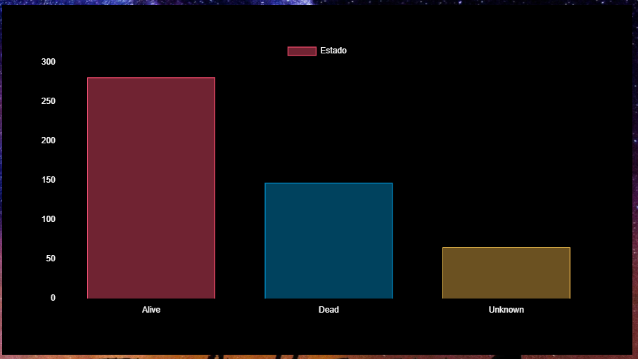

# Data Lovers

## Índice

* [1. Resumen del proyecto](#1-resumen-del-proyecto)
* [2. Resumen del proyecto](#2-objetivos-de-aprendizaje)
* [3. Investigación UX](#3-Investigación-UX)
* [4. Hacker edition ](#4-Hacker-edition)
* [5. Herramientas ](#5-Herramientas)

***

## 1. Resumen del proyecto

En este proyecto podremos visualizar una serie de datos que nos permitiran entender la serie rick and morthy, aqui se podra ver las caracteristicas de cada personaje de la serie, los diferentes espacios en los que se desarrolla la serie, asi como tambien podra ver la distribucion de la serie por temporadas y sus respectivos capitulos, ademas, podra ver una serie de estadisticas que le permitiran conocer caracteristicas de la serie de manera grafica y analitica.

## 2. Objetivos de aprendizaje

### HTML y CSS

* [x] [Uso de HTML semántico.](https://developer.mozilla.org/en-US/docs/Glossary/Semantics#Semantics_in_HTML)
* [x] Uso de selectores de CSS.
* [x] Construir tu aplicación respetando el diseño realizado (maquetación).
* [x] [Uso de flexbox en CSS.](https://css-tricks.com/snippets/css/a-guide-to-flexbox/)

### DOM y Web APIs

* [x] Uso de selectores del DOM.
* [x] Manejo de eventos del DOM.
* [x] [Manipulación dinámica del DOM.](https://developer.mozilla.org/es/docs/Referencia_DOM_de_Gecko/Introducci%C3%B3n)
(appendChild |createElement | createTextNode| innerHTML | textContent | etc.)

### JavaScript

* [x] Uso de condicionales (if-else | switch | operador ternario)
* [x] Uso de bucles (for | for..in | for..of | while)
* [x] Uso de funciones (parámetros | argumentos | valor de retorno)
* [x] Manipular arrays (filter | map | sort | reduce)
* [x] Manipular objects (key | value)
* [x] Uso ES modules ([`import`](https://developer.mozilla.org/en-US/docs/Web/JavaScript/Reference/Statements/import)
| [`export`](https://developer.mozilla.org/en-US/docs/Web/JavaScript/Reference/Statements/export))
* [x] Diferenciar entre expression y statements.
* [ ] Diferenciar entre tipos de datos primitivos y no primitivos.

### Testing

* [x] [Testeo unitario.](https://jestjs.io/docs/es-ES/getting-started)

### Estructura del código y guía de estilo

* [x] Organizar y dividir el código en módulos (Modularización)
* [x] Uso de identificadores descriptivos (Nomenclatura | Semántica)
* [x] Uso de linter (ESLINT)

### Git y GitHub

* [x] Uso de comandos de git (add | commit | pull | status | push)
* [x] Manejo de repositorios de GitHub (clone | fork | gh-pages)
* [ ] Colaboración en Github (branches | pull requests | |tags)

### UX

* [x] Diseñar la aplicación pensando y entendiendo al usuario.
* [x] Crear prototipos para obtener feedback e iterar.
* [x] Aplicar los principios de diseño visual (contraste, alineación, jerarquía)
* [x] Planear y ejecutar tests de usabilidad.

## 3. Investigación UX

Esta pagina va dirigida para los fans de la serie Rick and Morthy y tambien para las personas que esten interesadas en unirse a la comunidad de Rick and Morthy.

### Historias de usuario

Nos enfocamos en conocer al usuario y sus diferentes necesidades para asi enfatizar en ellas y cumplir con cada uno de los requerimientos.
en este link de [trello] (https://trello.com/invite/b/ceeViNat/d5861e20bceed3ddd57d832f123e63c4/data-lovers) podras encontrar las historias de usuario que se desarrollaron en este proyecto.

### Diseño de la Interfaz de Usuario

#### Prototipo de baja fidelidad
Basandonos en las historias de usuario creamos un prototipo de baja fidelidad que cumpliera con las expectativas y los criterios de aceptacion.

#### Prototipo de alta fidelidad

El prototipo de alta fidelidad toma como base el protitpo de baja fidelidad, toma estilos, colores e imagenes que se van a aplicar a la pagina.

https://www.figma.com/file/o67NcUuccKh9e9o1DA5Owi/DataLover?node-id=5%3A14

#### Testeos de usabilidad

El diseño de la busqueda por letras no se veia muy bien, piden que se le aplique otro tipo de color que resalte las letras.

No habia un boton que permitiera regresar a la pantalla principal, se añade el boton de "Home" a la lista desplegable.

## 4. Hacker edition

## 5. Herramientas

* [Git](https://git-scm.com/)
* [GitHub](https://github.com/)
* [GitHub Pages](https://pages.github.com/)
* [Node.js](https://nodejs.org/)
* [Jest](https://jestjs.io/)
* [Charts.js](https://www.chartjs.org)

